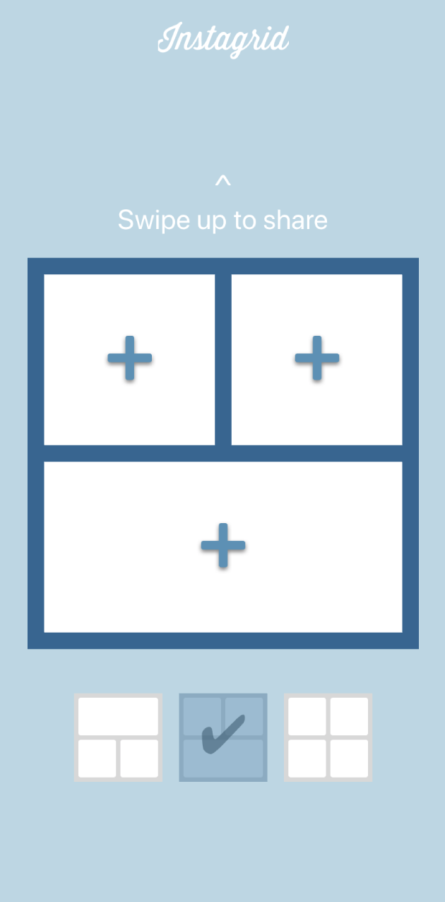
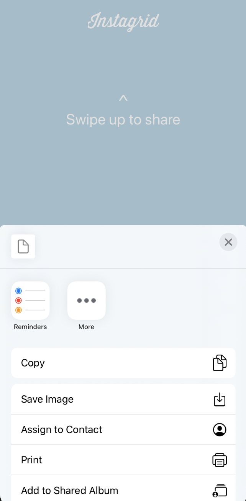
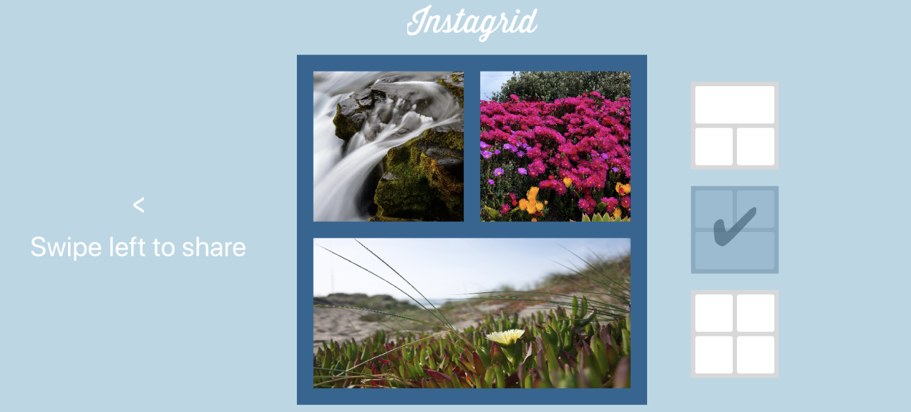

# Instagrid

### Contexte

Application réalisé dans le cadre de mon parcours développeur d'application iOS avec Openclassrooms (2018-2020).
Application pour iPhone développé en langage Swift.
Projet 4/12.

### Le projet

Création de l'application Instagrid pour iPhone(design responsive).
Elle permet de combiner plusieurs photos dans un format carré et de partager le résultat avec ses amis.
Disponible en mode portrait et en mode paysage.

### Compétences techniques

- Autolayout
- Vary for traits
- @IBOutlets / @IBActions
- DeviceOrientation
- UISwiperGestureRecognizer
- UIImagePickerController
- UIActivityController

### Screenshots

   

